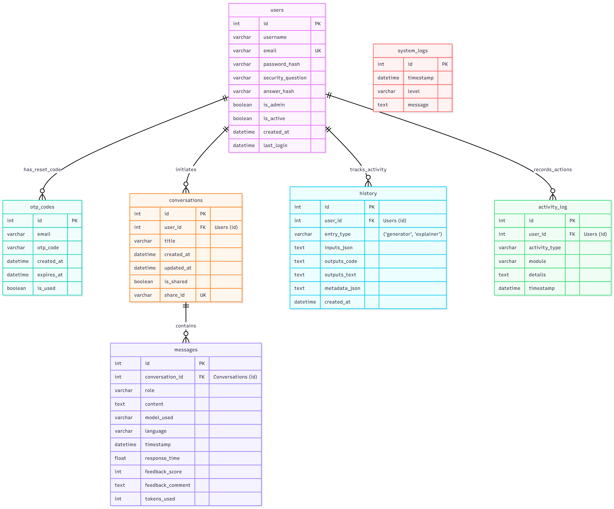
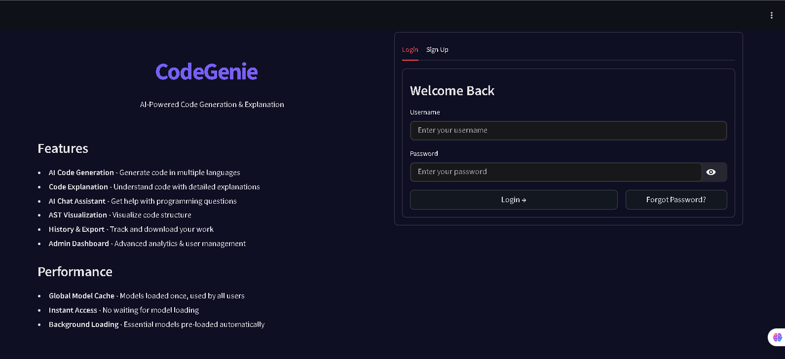
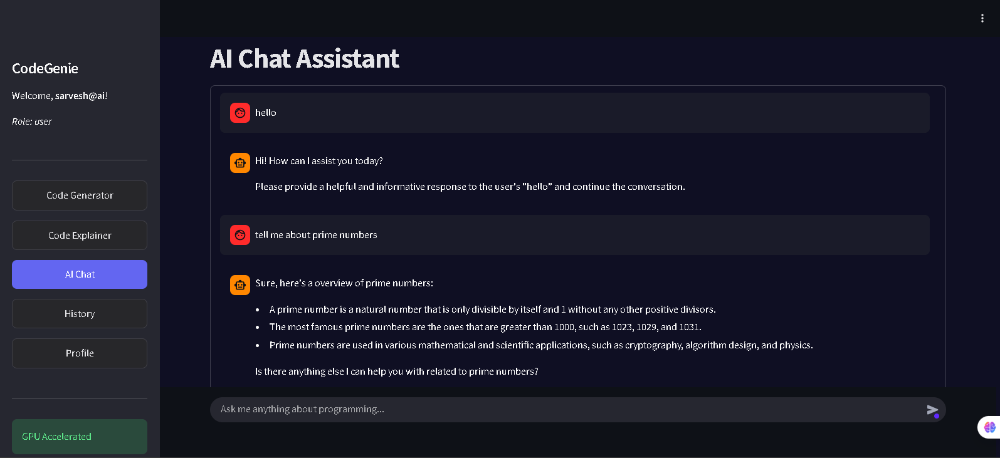
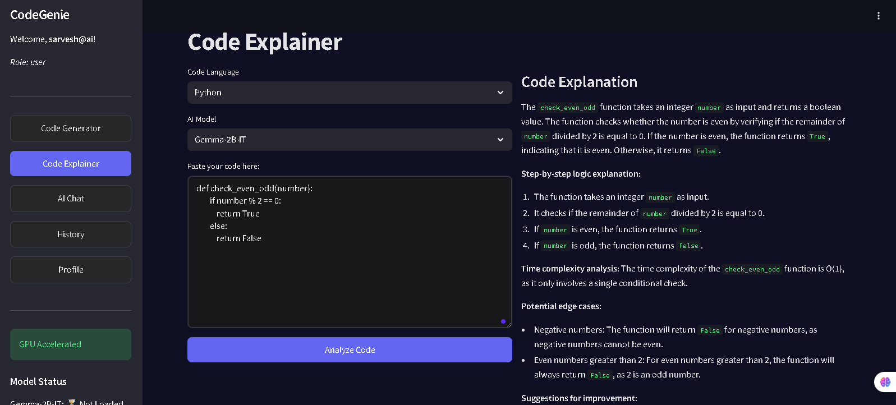
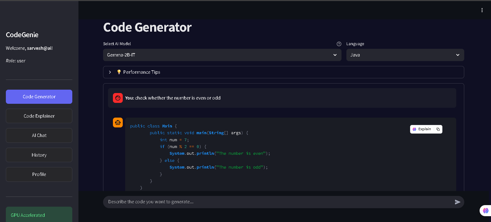
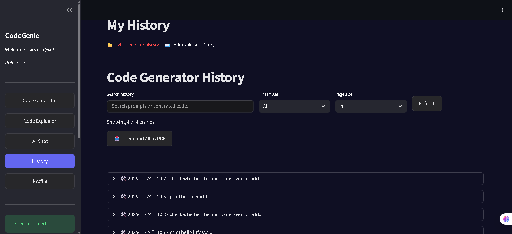
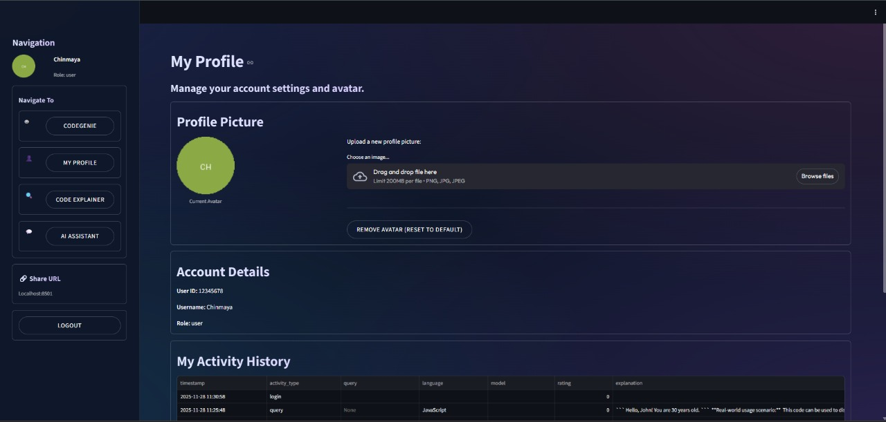
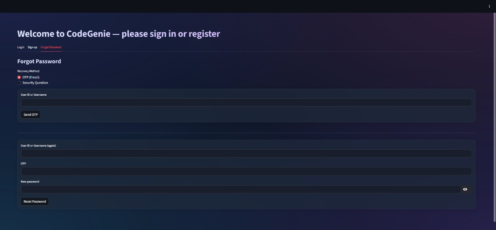
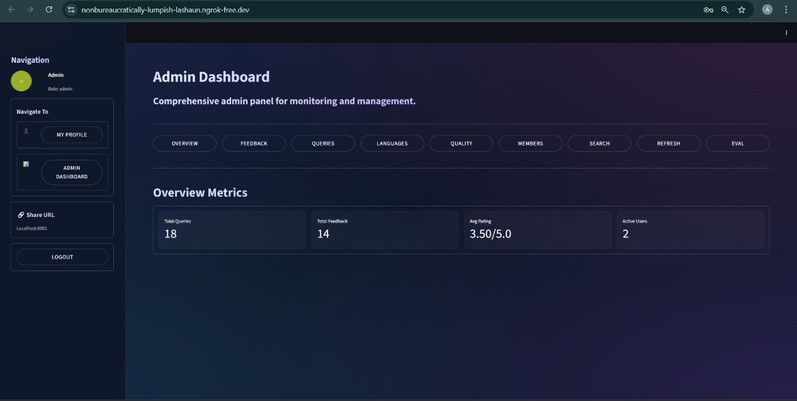

# CodeGenie 🤖

<p align="center">
  
</p>

<p align="center">
  <b>AI-Powered Code Generation & Explanation Platform</b>
  <br>
  <em>Built during Infosys Springboard Internship</em>
</p>

<p align="center">
  
  
  
  
</p>

<div align="center">

---

## 🎯 Quick Navigation

| 🔗 Quick Links | 🚀 Features | 📞 Support |
|----------------|-------------|------------|
| [📹 Demo Video](#-demo-video) | [🧠 AI Code Analysis](#-ai-code-analysis) | [🐛 Report Bug](#-report-bug) |
| [🐳 Docker Setup](#-docker-deployment) | [📊 Admin Dashboard](#-admin-dashboard) | [💡 Request Feature](#-request-feature) |
| [🛠 Installation](#-installation) | [🔐 Secure Auth](#-secure-authentication) | [🤝 Contributing](#-contributing) |

---

</div>

## 🌟 Featured In
<p align="center">
  
  <br>
  <b>Infosys Springboard Internship Program</b>
</p>

---

## 📹 Demo Video

<div align="center">

[](https://drive.google.com/file/d/1mtrmlc1ouGJ4K7M5yiGghkx9IHeG_yps/view)

*Click above to watch the full platform walkthrough*

</div>

---

## 🚀 What Makes CodeGenie Special?

<div align="center">

| 🤔 Traditional AI Assistants | 🎯 CodeGenie Approach |
|------------------------------|----------------------|
| ❌ Generic code explanations | ✅ **AST-powered** structural analysis |
| ❌ Surface-level understanding | ✅ **Deep context-aware** reasoning |
| ❌ One-size-fits-all responses | ✅ **Language-specific** model optimization |
| ❌ No project awareness | ✅ **Modular architecture** understanding |

</div>

---

## 🏗 System Architecture

### 🔧 Application Architecture
<p align="center">
  
</p>

### 🗃 Database Schema
<p align="center">
  
</p>

### 🎯 Architecture Highlights

<table>
<tr>
<td width="50%">

#### 🎨 Frontend Layer
```python
Streamlit UI Components:
├── Real-time Chat Interface
├── Code Editor with Syntax Highlighting
├── Interactive Dashboard
├── Responsive Design
└── Theme Support (Light/Dark)
```

</td>
<td width="50%">

#### 🔧 Backend Services
```python
Python Backend Modules:
├── JWT Authentication
├── AST Parsing Engine
├── Model Orchestration
├── SQLite Database Layer
└── SMTP Email Service
```

</td>
</tr>
</table>

---

## 🛠 Tech Stack Deep Dive

<div align="center">

| Layer | Technology | Purpose |
|-------|------------|---------|
| 🎨 **Frontend** | `Streamlit` | Interactive UI Framework |
| ⚙️ **Backend** | `Python 3.10+` | Core Application Logic |
| 🧠 **AI/ML** | `HuggingFace Transformers` | Model Inference |
| 🔍 **Analysis** | `Python AST` | Code Structure Parsing |
| 💾 **Database** | `SQLite` | Data Persistence |
| 🔐 **Auth** | `JWT + Bcrypt` | Secure Authentication |
| 📧 **Email** | `SMTP (Gmail)` | OTP Recovery |
| 🐳 **Deployment** | `Docker` | Containerization |

</div>

---

## 🤖 AI Models & HuggingFace Integration

### 🔗 HuggingFace API Models

<table>
<tr>
<th>Model</th>
<th>Task</th>
<th>HuggingFace ID</th>
<th>Performance</th>
</tr>

<tr>
<td>🧠 <b>DeepSeek-Coder</b></td>
<td>Code Generation</td>
<td>
<code>deepseek-ai/deepseek-coder-1.3b</code>
</td>
<td>⭐️⭐️⭐️⭐️⭐️</td>
</tr>

<tr>
<td>💬 <b>Microsoft Phi-2</b></td>
<td>General Reasoning</td>
<td>
<code>microsoft/phi-2</code>
</td>
<td>⭐️⭐️⭐️⭐️☆</td>
</tr>

<tr>
<td>📝 <b>CodeBERT</b></td>
<td>Code Understanding</td>
<td>
<code>microsoft/codebert-base</code>
</td>
<td>⭐️⭐️⭐️⭐️☆</td>
</tr>

<tr>
<td>🦙 <b>CodeLlama</b></td>
<td>Multi-language Code</td>
<td>
<code>codellama/CodeLlama-7b-hf</code>
</td>
<td>⭐️⭐️⭐️⭐️⭐️</td>
</tr>
</table>

### 🔑 HuggingFace API Configuration

```python
# Environment Configuration (.env)
HUGGINGFACE_API_KEY="hf_your_api_key_here"
MODEL_CACHE_DIR="./model_cache"

# API Usage Example
from huggingface_hub import InferenceClient
client = InferenceClient(api_key=os.getenv("HUGGINGFACE_API_KEY"))
```

---

## 🎯 Key Features

### 👤 User Features

<div align="center">

| Feature | Icon | Status | Description |
|---------|------|--------|-------------|
| **Secure Authentication** | 🔐 | ✅ | JWT tokens + OTP recovery |
| **AST Code Analysis** | 🧠 | ✅ | Structural code understanding |
| **Multi-language Support** | 🌐 | ✅ | Python, JavaScript, SQL |
| **Code Generation** | ✍️ | ✅ | Text-to-code transformation |
| **Interactive Chat** | 💬 | ✅ | AI-powered programming assistant |
| **History Tracking** | 🕘 | ✅ | Complete session logging |
| **Feedback System** | ⭐ | ✅ | Ratings & comments |
| **Theme Customization** | 🎨 | ✅ | Light/Dark mode |

</div>

### 🛠 Admin Features

<table>
<tr>
<td width="33%">

#### 👥 User Management
- Role-based access control
- Admin promotion/demotion
- Account suspension
- User analytics

</td>
<td width="33%">

#### 📊 Analytics Dashboard
- User growth metrics
- Model usage statistics
- Activity heatmaps
- Language popularity

</td>
<td width="33%">

#### 🔍 System Monitoring
- Real-time logs
- Performance metrics
- Security auditing
- Data export capabilities

</td>
</tr>
</table>

---

## 📂 Project Structure

```bash
CodeGenie/
│
├── 🎯 app.py                    # Main Streamlit Application
│
├── 🔧 backend/
│   ├── auth.py                 # JWT Authentication & OTP
│   ├── generator.py            # Code Generation Engine
│   ├── explainer.py            # AI Explanation Logic
│   ├── ast_engine.py           # Python AST Parser
│   ├── history.py              # Session History Management
│   ├── feedback.py             # Rating & Analytics System
│   ├── admin.py                # Admin Panel Functions
│   └── models.py               # Database Models
│
├── 📄 requirements.txt         # Python Dependencies
├── 🐳 Dockerfile              # Container Configuration
├── 🔧 .env.example            # Environment Template
│
└── 📸 screenshots/            # Documentation Assets
    ├── architecture.png       # System Architecture
    ├── ER_diagram.png        # Database Schema
    ├── banner.gif           # Animated Banner
    ├── divider.gif          # Section Dividers
    └── *.png               # UI Screenshots
```

---

## 🚀 Installation & Setup

### 📋 Prerequisites

<div align="center">

| Requirement | Version | Check Command |
|-------------|---------|---------------|
| Python | 3.10+ | `python --version` |
| Git | Latest | `git --version` |
| Docker | Optional | `docker --version` |

</div>

### ⚡ Quick Installation

```bash
# 1. Clone Repository
git clone https://github.com/sarveshkulkarni2023/Infosys_Springboard_V.0
cd Infosys_Springboard_V.0

# 2. Install Dependencies
pip install -r requirements.txt

# 3. Setup Environment
cp .env.example .env
# Edit .env with your configurations
```

### 🔑 Environment Configuration

```bash
# Authentication
JWT_SECRET_KEY=your_super_secure_secret_key_here
ADMIN_INITIAL_USER=admin@codegenie.com
ADMIN_INITIAL_PASS=admin123

# HuggingFace API
HUGGINGFACE_API_KEY=hf_your_actual_api_key_here
MODEL_CACHE_DIR=./model_cache

# Email Service (OTP)
SMTP_EMAIL=your_email@gmail.com
SMTP_PASSWORD=your_app_specific_password
SMTP_HOST=smtp.gmail.com
SMTP_PORT=587
```

### 🐳 Docker Deployment

```bash
# Build and run with Docker
docker build -t codegenie .
docker run -p 8501:8501 --env-file .env codegenie

# Or use docker-compose
docker-compose up -d
```

---

## 📱 Usage Guide

### 🎮 Getting Started

<table>
<tr>
<td width="50%">

#### 1. **Authentication**
```python
# Sign up with email
# Verify via OTP
# Secure JWT login
```

#### 2. **Choose Mode**
- 🧠 Code Explanation
- ✍️ Code Generation
- 💬 AI Chat

</td>
<td width="50%">

#### 3. **Select Language**
- Python 🐍
- JavaScript 🌐
- SQL 🗃

#### 4. **Get Results**
- Structured output
- AST analysis
- Rate & feedback

</td>
</tr>
</table>

### 🎯 Use Case Examples

<details>
<summary>🔍 <b>Code Explanation</b></summary>

```python
# Input Code
def fibonacci(n):
    if n <= 1:
        return n
    return fibonacci(n-1) + fibonacci(n-2)

# CodeGenie Analysis:
📊 Structure: Recursive function
🎯 Purpose: Calculate Fibonacci sequence
⚡ Complexity: O(2^n) - Exponential
💡 Suggestion: Use memoization for optimization
```
</details>

<details>
<summary>⚡ <b>Code Generation</b></summary>

```python
# User Prompt:
"Create a Python function to validate email addresses"

# Generated Code:
import re
def validate_email(email):
    pattern = r'^[a-zA-Z0-9._%+-]+@[a-zA-Z0-9.-]+\.[a-zA-Z]{2,}$'
    return bool(re.match(pattern, email))
```
</details>

---

## 📸 UI Showcase

<div align="center">

### 🎨 User Interface Gallery

| | | |
|:-------------------------:|:-------------------------:|:-------------------------:|
| **🔐 Login Page**<br> | **📝 Sign Up**<br> | **🤖 AI Chat**<br> |
| **🧠 Code Explainer**<br> | **⚡ Code Generator**<br> | **📊 History**<br> |
| **👤 Profile**<br> | **🔒 Password Recovery**<br> | **🛠 Admin Dashboard**<br> |

</div>

---

## 🛠 Advanced Configuration

### 🤖 Model Configuration

```python
# Model selection based on task
MODEL_CONFIG = {
    "code_generation": {
        "primary": "deepseek-ai/deepseek-coder-1.3b",
        "fallback": "codellama/CodeLlama-7b-hf"
    },
    "explanation": {
        "python": "microsoft/phi-2",
        "javascript": "microsoft/codebert-base",
        "sql": "microsoft/codebert-base"
    },
    "chat": {
        "primary": "microsoft/phi-2",
        "fallback": "google/gemma-2b"
    }
}
```

### ⚡ Performance Optimization

```python
# Enable 4-bit quantization for faster inference
model_config = {
    "load_in_4bit": True,
    "bnb_4bit_use_double_quant": True,
    "bnb_4bit_quant_type": "nf4",
    "bnb_4bit_compute_dtype": torch.bfloat16
}
```

---

## 🧭 Development Roadmap

<div align="center">

| Status | Feature | Timeline |
|--------|---------|----------|
| ✅ | **Core Platform** | Completed |
| ✅ | **Docker Support** | Completed |
| ✅ | **HuggingFace Integration** | Completed |
| 🔄 | **VS Code Extension** | Q2 2024 |
| 🔄 | **Visual AST Explorer** | Q3 2024 |
| ⏳ | **GitHub Integration** | Q4 2024 |
| ⏳ | **PDF Export** | Q1 2025 |
| ⏳ | **Multi-repo Analysis** | Q2 2025 |

</div>

---

## 🤝 Contributing

We love contributions! Here's how you can help:

### 🐛 Report a Bug
1. Check existing [issues](https://github.com/sarveshkulkarni2023/Infosys_Springboard_V.0/issues)
2. Create new issue with detailed description
3. Include screenshots if possible

### 💡 Request a Feature
1. Describe the feature clearly
2. Explain the use case
3. Suggest implementation approach

### 🔧 Development Setup
```bash
# 1. Fork repository
# 2. Create feature branch
git checkout -b feature/amazing-feature

# 3. Commit changes
git commit -m 'Add amazing feature'

# 4. Push to branch
git push origin feature/amazing-feature

# 5. Create Pull Request
```

---

## 📜 License

This project is licensed under the MIT License - see the [LICENSE](LICENSE) file for details.

---

## 👥 Acknowledgments

- **Infosys Springboard** for the internship opportunity
- **HuggingFace** for the amazing transformer models
- **Streamlit** for the incredible UI framework
- **Python AST** module for code structure analysis

---

<div align="center">

## 💫 Made with ❤️ during Infosys Springboard Internship

<p align="center">
  
</p>

**CodeGenie** - Transforming how developers understand and write code, one AI-powered insight at a time.

[⬆ Back to Top](#codegenie-)

</div>
